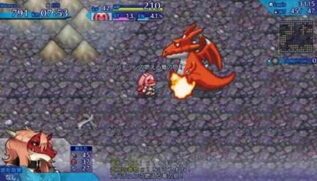

# LPOO_79 Endless Crusade

&nbsp;This project is to be based on the top down rogue rpg "One Way Heroics". The objective is for the player to go as far as they can while avoiding an ever approaching darkness. As such, the player will control an avatar that can move in four directions (up, down, left right), being able to attack in the same directions. The screen will scroll to the right with the darkness approaching from the left side, forcing most of the movements made by the player to be to the right. 

&nbsp;During a play session, the player will find randomly placed enemies and structures. All movements, from the enemies and the darkness, follow the pace of the player avatar's movements, the first of which move at a similar pace, while the darkness and the world surrounding the characters will move at a slower pace to allow a semblance of freedom when it comes to exploration.

&nbsp;The game ends when either the player is caught by the darkness, runs out of health points, or meets other specific requirements (possible future implementations), and is evaluated according to their performance (opened chests, enemies defeated, distance walked, etc...).

## Screenshots

&nbsp;Since we have not finished the game yet, here we show some screenshots of the original game:

## Install Instructions

> How can someone install the game in their computer.
