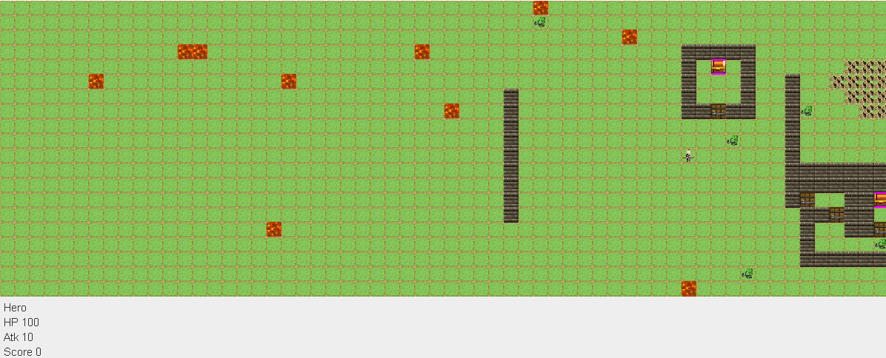
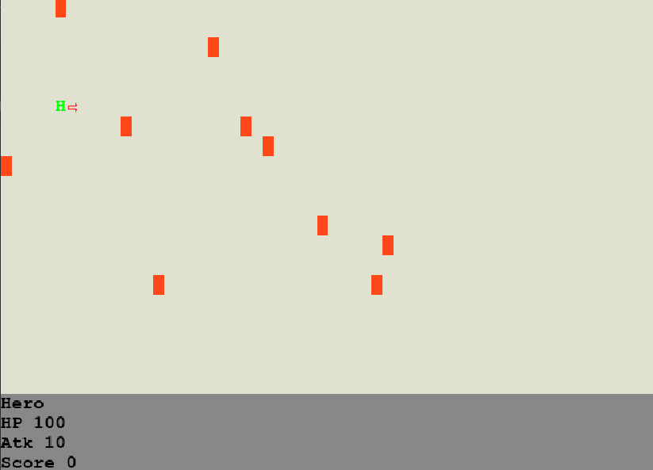

# LPOO_79 Endless Crusade
  
&nbsp;This project is to be based on the top down rogue rpg "One Way Heroics". The objective is for the player to go as far as they can while avoiding an ever approaching darkness. As such, the player will control an avatar that can move in four directions (up, down, left right), being able to attack in the same directions. The screen will scroll to the right with the darkness approaching from the left side, forcing most of the movements made by the player to be to the right. 

&nbsp;During a play session, the player will find randomly placed enemies and structures. All movements, from the enemies and the darkness, follow the pace of the player avatar's movements, the first of which move at a similar pace, while the darkness and the world surrounding the characters will move at a slower pace to allow a semblance of freedom when it comes to exploration.

&nbsp;The game ends when either the player is caught by the darkness, runs out of health points, or meets other specific requirements (possible future implementations), and is evaluated according to their performance (opened chests, enemies defeated, distance walked, etc...).

## Implemented Features

### Hero Orientation

&nbsp;The player character, the Hero, can only act in one of four directions (up, down, left and right). To allow the player to choose their targets accordingly, the game show to which direction the Hero is looking (in the terminal version, there is an arrow in said direction). You can change your direction without moving, if you press the CTRL key while pressing any arrow key.

### Player Direction

&nbsp;The Player Hero can walk in four directions and when he walks, if you are playing with lanterna, there's an arrow near him that shows his direction.

&nbsp;If you play the game using gradle, you will see some random characters near the player. Due to the lanterna terminal character encoding, we can't see the arrows. If you play with IntelliJ (press run in the IDE), you can see this arrows. 

 

### Enemy Pathfinding

&nbsp;Another feature already implemented is the enemy pathfinding. If an enemy is close to the player, it will start to follow the player until its dead. 

&nbsp;This is difficult to show with screenshots.

### Moving the World

&nbsp;With every action made by the player, the darkness moves to the right. To simulate this, the world shown on the screen would scroll to the left, along with every object shown on the screen.

### Tiles

&nbsp;Tiles are used for the floor and other elements like fire with which we can't interact.

### Structure Generator

&nbsp;Much like Tiles, the objective of the Structure Generator is to create a more varied setting. The generator should be capable of creating simple structures through the addition of Entities (that can act as several different kinds of objects). The generator reads files created by us with some characters that represent different entities. These files are in the folder structures of resources and have str in the extension.

### Different Views

&nbsp;Our game can be played using lanterna or swing. The first UI uses a terminal and some characters to represent entities. The second one uses sprites and a swing window.

## Design

### Develop different user interfaces

#### Problem in Context

&nbsp;Our game should be playable using Swing as well as Lanterna.

#### The Pattern

&nbsp;To solve this problem we followed the **MVC (Model-View-Controller) architectural patern**.

#### Implementation

&nbsp;Our game, in the package GAME, is divided in 3 big packages (GameModel, GameController and GameView). The GameModel only represents the data. The GameController interprets user actions and provides model data to the view. The GameView displays the model data - this vary depending on the GUI that will be used to play.

&nbsp;As of yet, our code is not fully prepared for an implementation of a Swing Viewer, for that it would be necessary to overhaul certain objects that contain appearance data (Entity and GameModel), changing them so they can hold more generic information related to their said appearance. One possible implementation of such would be enemy types, stored as an Enum, that would lead to specific parts of the code present in each viewer, showing the expected information on screen.

&nbsp;This feature is also present in the game menu (package Menu). The menu doesn't have a model because it wasn't necessary.

&nbsp;For every interface we want to implement, we only have to develop a new GameView and MenuView that knows how to use that interface.

#### Consequences

&nbsp;This pattern has very good consequences. With the MVC pattern:
- we can provide multiple views for our game;
- we don't need to repeat code that doesn't access the properties of the GUI (this follows the DRY principle);
- we can modify code without this affecting the entire project.

### Create different entities

#### Problem in Context

&nbsp;We want to create different entities with different properties.

#### The Pattern

&nbsp;To solve this problem we used the **Builder Pattern**.

#### Implementation

&nbsp;In the StructureGenerator class, we import different structures, with different entities. To create an entity according to the character read from the text file, we have a function that gives the EntityType and after we have this type, we call the builder of that character (we have a director that has a builder inside and we only change the structure director). After that we call the method make of the StructureDirector class that generates an Entity of the given type.

#### Consequences

&nbsp;To change the type of entity we are creating, we only have to change the Builder present in the StructureDirector class of the StructureGenerator. To create a new type of entity we have to create a new Builder to this type and added it to the StructureGenerator.

### Create different enemies

#### Problem in Context 

&nbsp;We want to create enemies with random properties.

#### The Pattern 

&nbsp;To solve this problem we used the **Builder Pattern** (EnemyBuilder implements the EntityBuilder).

#### Implementation

&nbsp;The GameController has a builder that produces enemies with random attack and health. This builder is called in a method called make in the EnemyGenerator make method. This method is called by the GameController whenever it wants to create an enemy.

#### Consequences

&nbsp;If we want to create a new type of enemy, we only have to create a new Builder, that implements the EnemyBuilder abstract class, and put a reference to this builder in the EnemyGenerator class.

### Change between menu and game

#### Problem in Context

&nbsp;Our game has a menu and it has to start the game when something happens.

#### The Pattern

&nbsp;To solve this problem we used the **State Pattern**.

#### Implementation

&nbsp;We have two big states in our project: the menu and the game. The menu is controlled by the MenuController and the game is controlled by the GameController. 

&nbsp;If you start the project the menu will appear. We have two options: start the game or exit. There are two more states inside the menu: one to draw a darker color in the play button and other to do the same in the exit button. To play the game, you have to press enter when the play button is darker.

&nbsp;When you start the game, a method run from the Application class is called. This method only creates a new GameController, a new GameModel and a new GameView. When you exit from the game by pressing the escape button or dying, the Application returns to the main state (the main method) where the Menu class is running.

#### Consequences

&nbsp;The Application can't be in two states at the same time, which means that only the menu or the game will appears to the player. When you finish the game, the menu appears in the initial state: the play button is darker than the menu button.

## Known Code Smells and Refactoring Suggestions

## Features Implemented/Code Developed Since The Demo

&nbsp;Since the demo, we implemented some new features: the swing view; new structures for the game; instructions in the menu.

&nbsp;We have also developed more code specially tests. In the demo, we only had tests of the intermediate delivery. Now we have tests that covers almost every classes. Some classes have a lower code coverage because their methods are private. To test the code we have used Mockito and due to the private methods we couldn't also test some parts of some public methods.

### Swing View

&nbsp;When the player chooses this view, instead of a text-based game, he will play a normal game. All the entities and tiles are sprites stored in the resources folder.

### New Structures

&nbsp;In the demo we showed some structures that appears in the game: a wall and a house. Now we have a bigger house, a castle and a mountain to complement the lack of structures that once appeared in the game.

### Instructions

&nbsp;For the players that don't want to discover how to play by themselves, we added, in both views, the instructions section.

### Tests

&nbsp;Like we said before, the tests were developed during this week. Since the intermediate delivery, we refactor some code to reduce the number of code smells, like the number of parameters of some methods, and this obey us to rewrite almost every test.  

## Testing Results

&nbsp;You can see [here](Reports/index.html) the last test coverage and mutation testing reports.

## Self-evaluation

&nbsp;We work equally, each contributing to the overall project design.
